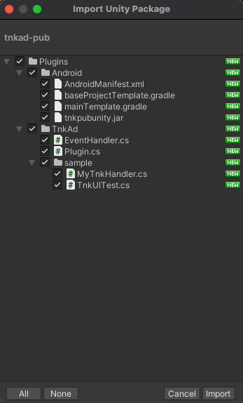
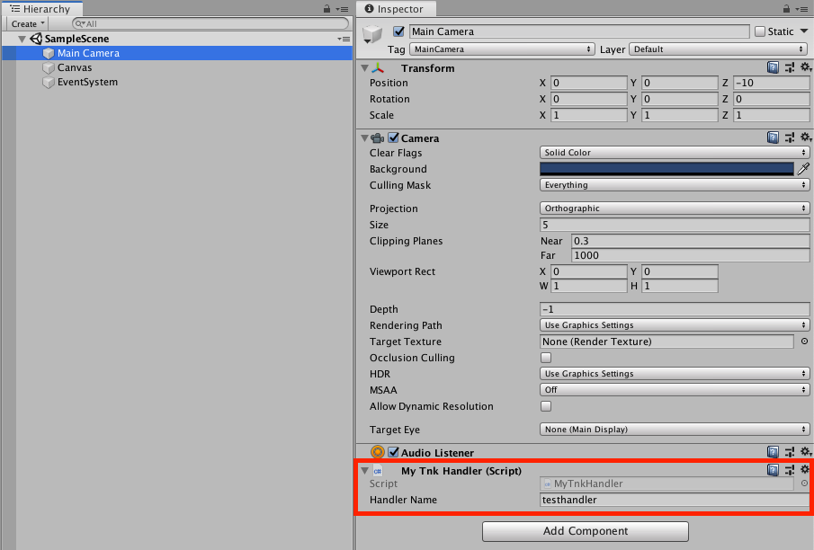

# Unity Plugin Guide

## 목차

1. [Unity Settings](#1-unity-settings)
   * [Plugin Download](#plugin-download)
   * [Plugin Import](#plugin-import)
   * [AdnroidMenifest.xml 설정](#adnroidmenifestxml-설정)
     * [Permission 설정](#permission-설정)
     * [Tnk Pub ID 설정](#tnk-pub-id-설정)
     * [UnityPlayer](#unityplayer-설정)
   * [COPPA 설정](#coppa-설정)
3. [Interstitial Ad](#2-interstitial-ad)
   * [Interstitial Ad](#use-interstitial-ad)
   * [Test Flight](#test-flight)
   * [Interstitial Ad APIs](#interstitial-ad-apis)
     * [TnkPub.Plugin - prepareInterstitialAd()](#tnkpubplugin---prepareinterstitialad)
       * [Method](#method)
       * [Description](#description)
       * [Parameters](#parameters)
     * [TnkPub.Plugin - showInterstitialAd()](#tnkpubplugin---showinterstitialad)
       * [Method](#method-1)
       * [Description](#description-1)
       * [Parameters](#parameters-1)
     * [EventHandler 이용하기](#eventhandler-이용하기)
     * [Sample](#sample)
3. [Banner Ad](#3-banner-ad)
   * [Use Banner Ad](#use-banner-ad)
   * [Test Flight](#test-flight-1)
   * [Banner Ad APIs](#banner-ad-apis)
     * [TnkPub.Plugin - showBannerAd()](#tnkpubplugin---showbannerad)
       * [Method](#method-2)
       * [Description](#description-2)
       * [Parameters](#parameters-2)
     * [TnkPub.Plugin - removeBannerAd()](#tnkpubplugin---removebannerad)
       * [Method](#method-3)
       * [Description](#description-3)
       * [Parameters](#parameters-3)
4. [EventHandler](#4-eventhandler)
   * [EventHandler 스크립트 만들기](#eventhandler-스크립트-만들기)
   * [GameObject에 추가하고 Handler Name 지정](#gameobject에-추가하고-handler-name-지정)
   * [설정한 Handler Name을 사용하여 Plugin API 호출](#설정한-handler-name을-사용하여-plugin-api-호출)

## 1. Unity Settings

### Plugin Download

Tnk에서 제공하는 tnkad-pub.unitypackage 파일을 다운 받습니다.

**[[Unity Plugin 다운받기](http://cdn1.tnkfactory.com/sdk/tnkad-pub.unitypackage)]**

### Plugin Import

적용할 Unity 프로젝트를 연 상태에서 다운로드 받은 tnkad-pub.unitypackage 파일을 실행하면 아래와 같이 Plugin 파일들에 대한 import 창이 열립니다. 



모두 선택된 상태에서 [import] 버튼을 누르면 Plugin 파일들이 프로젝트로 import 됩니다.

### AdnroidMenifest.xml 설정

Plugin 내에는 TnkAdAndroidMenifest.xml 파일이 포함되어 있습니다. 이 파일의 내용을 참고하시어 AndroidMenifest.xml 파일을 직접 작성하시거나 또는 Android project로 export 하신 후 생성된 AndroidMenifest.xml 파일을 기초로 TnkAd Pub SDK에서 필요로 하는 내용을 추가하시기 바랍니다.

작성하신 AndroidMenifest.xml 파일은 Unity 프로젝트의 Plugins/Android 폴더 저장하시기 바랍니다.

아래는 TnkAdAndroidMenifest.xml 파일의 내용입니다. 주석으로 되어 있는 부분의 설명을 확인하시고 본인의 AndroidMenifest.xml 파일에 반영해주세요.

> ##### TnkAdAndroidMenifest.xml

```xml
<?xml version="1.0" encoding="utf-8"?>
<manifest 
  xmlns:android="http://schemas.android.com/apk/res/android" 
  package="your.package.name" 
  android:theme="@android:style/Theme.NoTitleBar" 
  android:versionName="1.0" 
  android:versionCode="1" 
  android:installLocation="preferExternal">

  <uses-sdk android:minSdkVersion="16"/>
  
  <supports-screens 
    android:smallScreens="true" 
    android:normalScreens="true" 
    android:largeScreens="true" 
    android:xlargeScreens="true" 
    android:anyDensity="true" />
  
  <!-- permissions for Tnk Pub -->
  <uses-permission android:name="android.permission.INTERNET" />
  <uses-permission android:name="android.permission.ACCESS_WIFI_STATE" />
  
  <application 
    android:icon="@drawable/app_icon" 
    android:label="@string/app_name">

    <activity 
      android:label="@string/app_name" 
      android:screenOrientation="portrait" 
      android:launchMode="singleTask" 
      android:configChanges="mcc|mnc|locale|touchscreen|keyboard|keyboardHidden|navigation|orientation|screenLayout|uiMode|screenSize|smallestScreenSize|fontScale" 
      android:name="com.unity3d.player.UnityPlayerNativeActivity">

      <intent-filter>
        <action android:name="android.intent.action.MAIN" />
        <category android:name="android.intent.category.LAUNCHER" />
      </intent-filter>

      <meta-data android:name="unityplayer.UnityActivity" android:value="true" />
      <meta-data android:name="unityplayer.ForwardNativeEventsToDalvik" android:value="true" /> <!-- set true -->
    </activity>
    
    <!-- Set your Tnk Pub ID here -->
    <meta-data android:name="tnkad_pub_id" android:value="your-appid-from-tnk-site" />
  </application>
  
  <uses-feature android:glEsVersion="0x00020000" />
  <supports-gl-texture android:name="GL_OES_compressed_ETC1_RGB8_texture" />
</manifest>
```

#### Permission 설정

TnkAd SDK 가 필요로 하는 permission을 아래와 같이 설정합니다.

```xml
<uses-permission android:name="android.permission.INTERNET" />
```


#### Tnk Pub ID 설정

Tnk 사이트에서 앱 등록하면 상단에 App ID 가 나타납니다. 이를 AndroidMenifest.xml 파일의 <application> tag 안에 아래와 같이 설정합니다. 

(*your-application-id-from-tnk-site* 부분을 실제 App ID 값으로 변경하세요.)

```xml
<application>

     ...

    <meta-data android:name="tnkad_pub_id" android:value="your-application-id-from-tnk-site" />

</application>
```

#### UnityPlayer 설정

Unity 4.3 이상 버전을 사용하신다면 아래와 같이 ForwardNativeEventsToDalvik 옵션을 true로 설정하셔야 화면에 touch 이벤트가 동작합니다. 매체앱으로서 전면 중간광고 창을 띄우고자 하신다면 반드시 아래와 같이 설정해주세요. 광고만 진행하시는 경우에는 설정하실 필요가 없습니다.

```xml
<activity 
  android:label="@string/app_name" 
  android:screenOrientation="portrait" 
  android:launchMode="singleTask" 
  android:configChanges="mcc|mnc|locale|touchscreen|keyboard|keyboardHidden|navigation|orientation|screenLayout|uiMode|screenSize|smallestScreenSize|fontScale" 
  android:name="com.tnkfactory.spaceshootler.UnityPlayerNativeActivity">

  <intent-filter>
    <action android:name="android.intent.action.MAIN" />
    <category android:name="android.intent.category.LAUNCHER" />
  </intent-filter>

  <meta-data android:name="unityplayer.UnityActivity" android:value="true" />
  <meta-data android:name="unityplayer.ForwardNativeEventsToDalvik" android:value="true" /> <!-- set true -->
</activity>
```

### COPPA 설정

COPPA는 [미국 어린이 온라인 개인정보 보호법](https://www.ftc.gov/tips-advice/business-center/privacy-and-security/children's-privacy) 및 관련 법규입니다. 구글 에서는 앱이 13세 미만의 아동을 대상으로 서비스한다면 관련 법률을 준수하도록 하고 있습니다. 연령에 맞는 광고가 보일 수 있도록 아래의 옵션을 설정하시기 바랍니다.

```c#
using UnityEngine;
using System.Collections;

public class TnkUITest : MonoBehaviour {

  void Start ()
  {
  	TnkPub.Plugin.Instance.setCOPPA(true); // ON - 13세 미안 아동을 대상으로 한 서비스 일경우 사용
  	TnkPub.Plugin.Instance.setCOPPA(false); // OFF - 기본값
  
  // ...
}
```

## 2. Interstitial Ad

전면 광고 적용을 위해서는 Tnk 사이트에서 앱 등록 Unity Plugin 관련 설정이 우선 선행되어야합니다.
[[Unity Settings]](#1-unity-settings) 의 내용을 우선 확인해주세요.

### Use Interstitial Ad

전면 광고를 띄우는 것은 아래와 같이 간단합니다.

```c#
using UnityEngine;
using System.Collections;

public class TnkUITest : MonoBehaviour {

  void Start ()
  {
  }
  
  void Update ()
  {
  }
  
  void OnGUI ()
  {
    if (GUI.Button(new Rect (100, 100, 200, 80), "Load Interstitial Ad")) {
      Debug.Log("Load interstitial Ad");
      
      TnkPub.Plugin.Instance.prepareInterstitialAd("PLACEMENT_ID");
    }
    
    if (GUI.Button(new Rect (100, 200, 200, 80), "Show Interstitial Ad")) {
      Debug.Log("Show interstitial Ad");
      
      // 광고 로딩이 완료 된 후 호출
      TnkPub.Plugin.Instance.showInterstitialAd("PLACEMENT_ID");
    }
  }
}
```

### Test Flight

아래의 PLACEMENT ID를 사용하시면 별도로 계정이나 앱을 등록하지 않아도 간단하게 테스트 광고를 띄워보실 수 있습니다.

단, [[Tnk Pub ID 설정]](#tnk-pub-id-설정)을 하지 않고 하셔야 광고가 나옵니다. Tnk Pub ID 설정을 진행하셨다면 아래 ID로 테스트 광고를 띄우기 위해서 해당 설정을 주석 처리 또는 제거 후 진행해주세요.

- TEST_INTERSTITIAL_H : 전면 광고 가로
- TEST_INTERSTITIAL_V : 전면 광고 세로
- TEST_INTERSTITIAL_V_FINISH : 전면 광고 세로 (종료시 2-Button 형)
- TEST_REWARD_V : 리워드 동영상 광고

### Interstitial Ad APIs

전면 광고를 띄우기 위해서 사용하는 prepareInterstitialAd() 와 showInterstitialAd() 의 API 규약은 아래와 같습니다.

#### TnkPub.Plugin - prepareInterstitialAd()

##### Method

- void prepareInterstitialAd(string placementId)
- void prepareInterstitialAd(string placementId, string handleName)

##### Description

하나의 전면광고를 로딩합니다. 로딩된 전면광고는 이후 showInterstitialAd() API를 호출하여 화면에 띄울수 있습니다. EventHandler의 이름을 지정하면 전면광고관련 이벤트 발생시점에 EventHandler 객체의 메소드들이 호출됩니다.

##### Parameters

| 파라메터 명칭 | 내용                                                         |
| ------------- | ------------------------------------------------------------ |
| placementId     | Placement ID                                                    |
| handlerName   | EventHandler 객체의 이름                                     |

#### TnkPub.Plugin - showInterstitialAd()

##### Method

- void showInterstitialAd(string placementId)

##### Description

prepareInterstitialAd()를 통하여 로딩된 전면광고를 화면에 띄웁니다.

##### Parameters

| 파라메터 명칭 | 내용                     |
| ------------- | ------------------------ |
| placementId     | Placement ID     |

### EventHandler 이용하기

전면광고의 로딩이 완료되거나 사용자가 전면광고 화면을 닫는 경우 해당 이벤트 발생시점에 필요한 로직을 구현하기 위해서는 EventHandler 객체를 생성해야합니다.
EventHandler 클래스는 포인트 조회나 포인트 인출과 같이 비동기로 결과를 받아야 하는 경우 또는 중간 전면광고에서 발생하는 이벤트를 처리하기 위해서 제공되는 클래스입니다.
EventHandler 에 대한 자세한 내용은 [[EventHandler]](#4-eventhandler) 를 참고하세요.


전면 광고와 관련되어 EventHandler에서 발생하는 이벤트들은 아래와 같습니다.

* onClose(int type) : 전면 화면이 닫히는 시점에 호출됩니다. 화면이 닫히는 이유가 type 파라메터로 전달됩니다.
  * CLOSE_SIMPLE (0) : 사용자가 전면 화면의 닫기 버튼이나 Back 키를 눌러서 닫은 경우입니다.
  * CLOSE_CLICK (1) : 사용자가 전면 화면의 광고를 클릭하여 해당 광고로 이동하는 경우 입니다.
  * CLOSE_EXIT (2) : 전면 화면에 앱 종료버튼이 있는 경우 사용자가 앱 종료 버튼을 누른 경우입니다. 이 경우 앱을 종료하는 로직을 EventHandler에 구현해야합니다.
* onFailure(string error) : 전면 광고를 가져오지 못한 경우 호출이 됩니다. 에러 메시지가 error 파라메터로 전달됩니다.
* onLoad(string placementId) : prepareInterstitialAd() 호출하여 전면광고를 성공적으로 가져온 경우 호출됩니다. 만약 전면광고가 도착하기 전에 showInterstitialAd() 가 호출되었다면 광고가 노출되지 않습니다.
* onShow() : 전면광고가 화면에 나타날 때 호출됩니다.

#### Sample

아래의 예시는 EventHandler를 사용하여 광고가 로딩되는 시점에 광고를 띄워주는 구현 예시입니다.

> EventHandler Sample

```c#
using UnityEngine;
using System.Collections;

public class MyTnkHandler : TnkPub.EventHandler {

  ...
    
	public override void onLoad(string placementId) {
		Debug.Log("##### TnkPub.Listener onLoad() placementId = " + placementId);

		TnkPub.Plugin.Instance.showInterstitialAd(placementId);
	}
  
  ...
}
```

```c#
using UnityEngine;
using System.Collections;

public class TnkUITest : MonoBehaviour {

    ...
    
  void OnGUI ()
  {
    if (GUI.Button(new Rect(100, 100, 200, 80), "Show Interstitial Ad")) {
        Debug.Log("Show Interstitial Ad");

        TnkPub.Plugin.Instance.prepareInterstitialAd("PLACEMENT_ID", "testhandler");
    }
  }
  
  ...
}
```

## 3. Banner Ad

전면 광고 적용을 위해서는 Tnk 사이트에서 앱 등록 Unity Plugin 관련 설정이 우선 선행되어야합니다.
[[Unity Settings]](#1-unity-settings) 의 내용을 우선 확인해주세요.

### Use Banner Ad

배너 광고를 띄우는 것은 아래와 같이 간단합니다.

```c#
using UnityEngine;
using System.Collections;

public class TnkUITest : MonoBehaviour {

    void Start ()
    {

    }
    
    void Update ()
    {
        if (Application.platform == RuntimePlatform.Android) {
            if (Input.GetKeyUp(KeyCode.Escape)) {
                Application.Quit();
            }
        }
    }
    
    void OnGUI ()
    {
        if (GUI.Button(new Rect(100, 300, 200, 80), "Show Banner Ad")) {
            Debug.Log("Show Banner Ad");

            TnkPub.Plugin.Instance.showBannerAd("PLACEMENT_ID", TnkPub.BannerPosition.Bottom);
        }

        if (GUI.Button(new Rect(100, 400, 200, 80), "Remove Banner Ad")) {
            Debug.Log("Remove Banner Ad");

            TnkPub.Plugin.Instance.removeBannerAd("PLACEMENT_ID");
        }
    }
}

```
### Test Flight

아래의 PLACEMENT ID를 사용하시면 별도로 계정이나 앱을 등록하지 않아도 간단하게 테스트 광고를 띄워보실 수 있습니다.

단, [[Tnk Pub ID 설정]](#tnk-pub-id-설정)을 하지 않고 하셔야 광고가 나옵니다. Tnk Pub ID 설정을 진행하셨다면 아래 ID로 테스트 광고를 띄우기 위해서 해당 설정을 주석 처리 또는 제거 후 진행해주세요.

- TEST_BANNER_100 : 배너 광고 (640x100)
- TEST_BANNER_200 : 배너 광고 (640x200)

### Banner Ad APIs

전면 광고를 띄우기 위해서 사용하는 prepareInterstitialAd() 와 showInterstitialAd() 의 API 규약은 아래와 같습니다.

#### TnkPub.Plugin - showBannerAd()

##### Method

- void showBannerAd(string placementId, BannerPosition bannerPosition)
- void showBannerAd(string placementId, BannerPosition bannerPosition, string handleName)

##### Description

하나의 배너광고를 띄워줍니다. 

EventHandler의 이름을 지정하면 전면광고관련 이벤트 발생시점에 EventHandler 객체의 메소드들이 호출됩니다.

##### Parameters

| 파라메터 명칭 | 내용                                                         |
| ------------- | ------------------------------------------------------------ |
| placementId     | Placement ID                                                    |
| bannerPosition | 배너 위치 (Top, Bottom, Center)                                   |
| handlerName   | EventHandler 객체의 이름                                     |

#### TnkPub.Plugin - removeBannerAd()

##### Method

- void removeBannerAd(string placementId)

##### Description

배너광고를 제거합니다.

##### Parameters

| 파라메터 명칭 | 내용                                                         |
| ------------- | ------------------------------------------------------------ |
| placementId     | Placement ID                                                    |


## 4. EventHandler

EventHandler 클래스는 포인트 조회나 포인트 인출과 같이 비동기로 결과를 받아야 하는 경우 또는 중간 전면광고에서 발생하는 이벤트를 처리하기 위해서 제공되는 클래스입니다. 
EventHandler 클래스의 모습은 아래와 같습니다.

> EventHandler 클래스

```c#
using UnityEngine;
using System.Collections;
using System;

namespace TnkPub {
	public class EventHandler : MonoBehaviour {
		// onClose(int type)
		public const int CLOSE_SIMPLE = 0; // users simply closed ad view.
		public const int CLOSE_CLICK = 1; // users clicked ad view.
		public const int CLOSE_EXIT = 2; // users clicked exit app button.

		// Set 'Handler Name' in Unity Inspector
		public string handlerName;
		
		void Awake() {
            //Debug.Log("##### Awake() handlerName = " + handlerName);
            gameObject.name = handlerName;
			DontDestroyOnLoad(gameObject);
		}

		public void onFailureBinding(string error) {
            //Debug.Log("##### onFailureBinding() error = " + error);
            onFailure(error);
		}
		
		public void onLoadBinding(string placementId) {
            //Debug.Log("##### onLoadBinding() placementId = " + placementId);
            onLoad(placementId);
		}
		
		public void onShowBinding(string dummy) {
			//Debug.Log("##### onShowBinding() ");
			onShow();
		}

        public void onClickBinding(string dummy) {
            //Debug.Log("##### onClickBinding() ");
            onClick();
        }

        public void onCloseBinding(string type)
        {
            //Debug.Log("##### onCloseBinding() type = " + type);
            int typeCode = int.Parse(type);
            onClose(typeCode);
        }

        public void onVideoCompletedBinding(string verify)
        {
            //Debug.Log("##### onVideoCompletedBinding() verify = " + verify);
            if (String.Compare(verify, "Y") == 0)
            {
                onVideoCompleted(true);
            }
            else
            {
                onVideoCompleted(false);
            }
        }

        // AdListener
        public virtual void onFailure(string error) { }
        public virtual void onLoad(string placementId) { }
        public virtual void onShow() { }
        public virtual void onClick() { }
        public virtual void onClose(int type) { }
        public virtual void onVideoCompleted(bool verify) { }
    }
}
```

EventHandler를 사용하기 위해서 다음과 같이 진행하세요.

1. 우선 새로운 스크립트를 생성하시고 상위 클래스를 EventHandler로 변경합니다.
2. 처리해야할 메소드를 override 하여 구현합니다. (EventHandler의 모든 메소드를 override 하실 필요는 없습니다. 처리해야햘 메소드만 구현하세요.)
3. 구현된 클래스를 Unity의 Scene 화면의 GameObject 객체에 추가합니다. (기존의 GameObject에 추가하셔도 되고 새로운 GameObject를 생성하시어 추가하여도 상관없습니다.)
4. Unity Inspector 화면에서 추가한 스크립트의 Handler Name 속성에 이름을 지정합니다. 여기에 지정된 이름이 TnkPub.Plugin의 API 호출시 사용됩니다.

#### EventHandler 스크립트 만들기

> ##### EventHandler 구현 예시

```c#
using UnityEngine;
using System.Collections;

public class MyTnkHandler : TnkPub.EventHandler {

	public override void onFailure(string error) {
		Debug.Log("##### TnkPub.Listener onFailure() errCode = " + error);
	}
	
	public override void onLoad(string placementId) {
		Debug.Log("##### TnkPub.Listener onLoad() placementId = " + placementId);

		TnkPub.Plugin.Instance.showInterstitialAd(placementId);
	}

    public override void onShow() {
		Debug.Log("##### TnkPub.Listener onShow() ");
	}

    public override void onClick() {
        Debug.Log("##### TnkPub.Listener onClick() ");
    }

    public override void onClose(int type) {
        Debug.Log("##### TnkPub.Listener onClose() type = " + type.ToString());
        if (type == CLOSE_EXIT) {
            Application.Quit();
        }
    }

    public override void onVideoCompleted(bool verify) {
        Debug.Log("##### TnkPub.Listener onVideoCompleted() verify = " + verify);
    }
}
```

#### GameObject에 추가하고 Handler Name 지정



#### 설정한 Handler Name을 사용하여 Plugin API 호출

> EventHandler 사용 예시

```c#
if (GUI.Button(new Rect(100, 100, 200, 80), "Show Interstitial Ad")) {
    Debug.Log("Show Interstitial Ad");

    TnkPub.Plugin.Instance.prepareInterstitialAd("PLACEMENT_ID", "testhandler");
}
```
